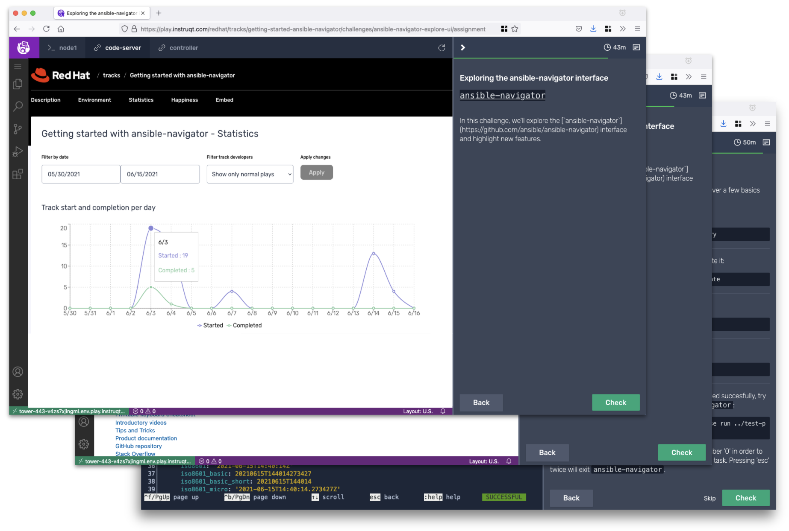

# eda-gitea-example
Example rulebook and playbooks to respond to Gitea repository events via webhook

`gitea-webhook-rulebook.yml` is an Event-Driven Ansible rulebook that waits for POST events on an endpoint and processes payload for different Gitea events by running the appropriate playbooks to respond PUSH and PULL_REQUEST events.

## To get hands-on experience with this rulebook, check out "Gitops with Event-Driven Ansible" available [after this page](https://www.redhat.com/en/engage/redhat-ansible-automation-202108061218)

